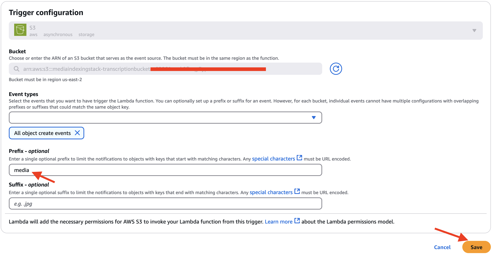
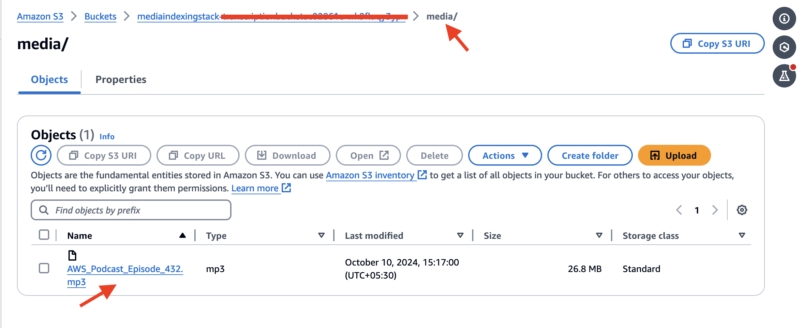

# Media Search and Indexing using Amazon Transcribe and Amazon Kendra

In today’s digital age, video and audio content is abundant, but finding specific information within videos can be challenging. By leveraging Amazon Kendra, this sample code aims to transform video and audio content into a searchable format, enabling users to quickly locate and access specific segments or topics within the media files.

(Disclaimer :- This code is intended solely to demonstrate the capabilities of AI/ML services and is not meant for production use. The IAM roles and permissions used in this sample code follow the principle of least privilege. If you wish to implement similar code in a production environment, please configure roles and permissions according to your specific requirements.)


# AWS Services

The  Media Search and Indexing uses a number of AWS services to work properly:

- [Amazon S3](https://aws.amazon.com/s3/)
- [Amazon Transcribe](https://aws.amazon.com/transcribe/)
- [Amazon Lambda](https://aws.amazon.com/lambda/)
- [Amazon EventBridge](https://aws.amazon.com/eventbridge/)
- [Amazon Kendra](https://aws.amazon.com/kendra/)


# Architecture Overview

The diagram below presents the architecture of the Media Search and Indexing and illustrates the different AWS resources used.


## Workflow

1. The media files is uploaded in the **media** folder of Media Files [Amazon S3](https://aws.amazon.com/s3/) bucket, which triggers s3_crawl_fn [AWS Lambda](https://aws.amazon.com/lambda/) function with the help of Amazon S3 trigger configured for **media** folder.

1. The s3_crawl_fn [AWS Lambda](https://aws.amazon.com/lambda/) is used for validating the file and initiating a transcribe job in [Amazon Transcribe](https://aws.amazon.com/transcribe/).

1. The [Amazon Transcribe](https://aws.amazon.com/transcribe/) reads the media file from [Amazon S3](https://aws.amazon.com/s3/) bucket for the transcribe job and stores the output in **transcribe_job_output** folder in Media Files [Amazon S3](https://aws.amazon.com/s3/) bucket. It also notifies [Amazon EventBridge](https://aws.amazon.com/eventbridge/) about the completion of transcription job.

1. [Amazon EventBridge](https://aws.amazon.com/eventbridge/) on receiving the notification for complemtion of transcribe job, triggers transcribe_process_fn [AWS Lambda](https://aws.amazon.com/lambda/) function.

1. The transcribe_process_fn [AWS Lambda](https://aws.amazon.com/lambda/) function talks to [Amazon Transcribe](https://aws.amazon.com/transcribe/) to get the transcribe job details. Then it reads and transforms the output of transcribe job into metadata which will be used by [Amazon Kendra](https://aws.amazon.com/kendra/) and stores it in **transcriptions** folder of Media Files [Amazon S3](https://aws.amazon.com/s3/) bucket.

1. The metadata stored in **transcriptions** folder of Media Files [Amazon S3](https://aws.amazon.com/s3/) bucket is used by [Amazon Kendra](https://aws.amazon.com/kendra/) for indexing the media files and enabling search to access specific segments or topics within the media files.

# Deployment of AWS Resources

## Prerequisites

1. Clone this GitHub Repo in your local IDE by running the below command in terminal:

    ```
    $ git clone https://github.com/aws-samples/aws-transcribe-kendra-media-search-workshop.git
    ```
2. Change Directory,

    ```
    $ cd media_indexing/
    ```

## Deploying the solution

You should explore the contents of this project. It demonstrates a CDK app with an instance of a stack (media_indexing_stack). The cdk.json file tells the CDK Toolkit how to execute your app. Follow the below steps to deploy the solution.

1. Create a virtualenv,
    
    ```
    $ python3 -m venv .venv
    ```
2. After the virtualenv is created, activate your virtualenv,
    ```
    $ source .venv/bin/activate
    ```
3. Once the virtualenv is activated, you can install the required dependencies,
    ```
    $ pip install -r requirements.txt
    ```
4. At this point you can now synthesize the CloudFormation template for this code,
    ```
    $ cdk synth
    ```
5. Deploy this stack to your default AWS account/region
    ```
    $ cdk deploy
    ```
## Implementation

Make sure that you have deployed the CDK. Follow these steps for implementing the solution:

1. To create a trigger from S3 (media indexing bucket) to Lambda (S3 crawl function) with the S3 prefix set to "media", follow these steps:

    1. Open the AWS Lambda console and navigate to your S3 crawl function.
    2. In the "Function overview" section, click on "Add trigger"
    3. In the "Trigger configuration" dialog:
   
        - Select "S3" as the trigger type
        - Choose your media indexing bucket from the "Bucket" dropdown menu
        - For "Event type", select "All object create events" (or a specific create event type if preferred)
        - In the "Prefix" field, enter "media"
        - Leave the "Suffix" field blank unless you want to filter by file type
        - Ensure the "Enable trigger" checkbox is selected
        - Review the configuration and click "Add" to create the trigger
      
    

    Now when you upload a file to the "media" folder in your S3 bucket, it will automatically invoke your Lambda function. The function will receive an event containing details about the            uploaded object, including the bucket name and object key
    
2. To test the solution, follow these steps to upload a file from the media data folder to your S3 bucket:
  
   1. Navigate to the GitHub repository containing the media data folder.
   2. Download the media file from the media folder in the repository to your local machine.
   3. Open the AWS Management Console and go to the S3 service.
   4. Locate and select the media indexing bucket you created earlier.
   5. Inside the bucket, upload the downloaded media file to the "media" folder in your S3 bucket:

        - Click the "Upload" button
        - Select the file from your local machine
        - Ensure the destination is set to the "media" folder
        - Complete the upload process
          
    
   
    Once the file is uploaded, the transcription job will automatically begin. The AWS Transcribe service will process the media file and generate the transcription output. This output will be      placed in the job output folder within your S3 bucket. You can monitor the progress of the transcription job in the AWS Transcribe console and retrieve the results from the specified output     location in your S3 bucket once the job is complete.

4. (Optional) Creating a Kendra Index 

    To make the media files searchable, you can create a Kendra index (https://docs.aws.amazon.com/kendra/latest/dg/create-index.html). This will take the transcription, that we saved in the         previous step as an input.

## License
This library is licensed under the MIT-0 License. See the LICENSE file.
