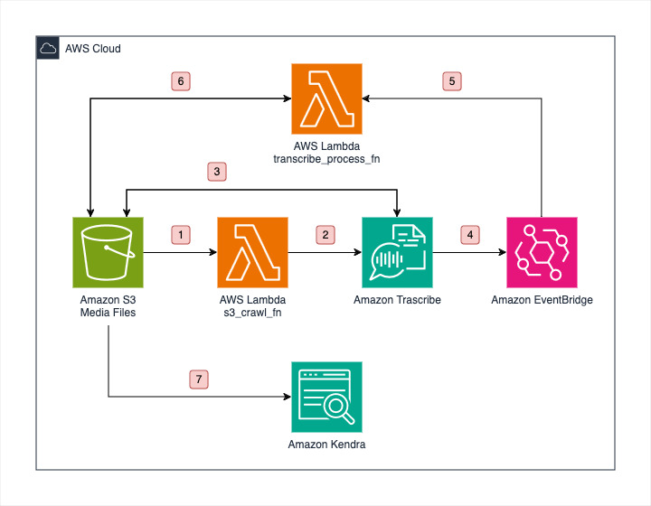

# Media Search and Indexing using Amazon Transcribe and Amazon Kendra

In today’s digital age, video and audio content is abundant, but finding specific information within videos can be challenging. By leveraging Amazon Kendra, this workshop aims to transform video and audio content into a searchable format, enabling users to quickly locate and access specific segments or topics within the media files.

# Tech

The  Media Search and Indexing uses a number of cloud resources and open source projects to work properly:

- [AWS Services](https://aws.amazon.com/)

# Architecture Overview

The diagram below presents the architecture of the Media Search and Indexing and illustrates the different AWS resources used.



## Workflow

1. The media files is uploaded in the **media** folder of Media Files [Amazon S3](https://aws.amazon.com/s3/) bucket, which triggers s3_crawl_fn [AWS Lambda](https://aws.amazon.com/lambda/) function with the help of Amazon S3 trigger configured for **media** folder.

1. The s3_crawl_fn [AWS Lambda](https://aws.amazon.com/lambda/) is used for validating the file and initiating a transcribe job in [Amazon Transcribe](https://aws.amazon.com/transcribe/).

1. The [Amazon Transcribe](https://aws.amazon.com/transcribe/) reads the media file from [Amazon S3](https://aws.amazon.com/s3/) bucket for the transcribe job and stores the output in **transcribe_job_output** folder in Media Files [Amazon S3](https://aws.amazon.com/s3/) bucket. It also notifies [Amazon EventBridge](https://aws.amazon.com/eventbridge/) about the completion of transcription job.

1. [Amazon EventBridge](https://aws.amazon.com/eventbridge/) on receiving the notification for complemtion of transcribe job, triggers transcribe_process_fn [AWS Lambda](https://aws.amazon.com/lambda/) function.

1. The transcribe_process_fn [AWS Lambda](https://aws.amazon.com/lambda/) function talks to [Amazon Transcribe](https://aws.amazon.com/transcribe/) to get the transcribe job details. Then it reads and transforms the output of transcribe job into metadata which will be used by [Amazon Kendra](https://aws.amazon.com/kendra/) and stores it in **transcriptions** folder of Media Files [Amazon S3](https://aws.amazon.com/s3/) bucket.

1. The metadata stored in **transcriptions** folder of Media Files [Amazon S3](https://aws.amazon.com/s3/) bucket is used by [Amazon Kendra](https://aws.amazon.com/kendra/) for indexing the media files and enabling search to access specific segments or topics within the media files.

# Deployment of AWS Resources

## Prerequisites

1. Go to AWS Console and open AWS Cloud9.
2. Click on **Create environment**.
3. On the Create environment page, fill name as **media-search-yourname**, for instance type select **Large General Purpose instance** and leave all the other options as default.
4. Click on **Create**.
5. Once the creation of environment is done, **open** Cloud9 IDE.
6. Clone this GitHub Repo in the IDE by replacing the value of URL with **Clone URL* and running the below command in terminal,

    ```
    $ git clone URL
    ```
7. Change Directory,

    ```
    $ cd media_indexing/
    ```

## Deploying the solution

You should explore the contents of this project. It demonstrates a CDK app with an instance of a stack (media_indexing_stack). The cdk.json file tells the CDK Toolkit how to execute your app. Follow the below steps to deploy the solution.

1. Create a virtualenv,
    
    ```
    $ python3 -m venv .venv
    ```
2. After the virtualenv is created, activate your virtualenv,
    ```
    $ source .venv/bin/activate
    ```
3. Once the virtualenv is activated, you can install the required dependencies,
    ```
    $ pip install -r requirements.txt
    ```
4. At this point you can now synthesize the CloudFormation template for this code,
    ```
    $ cdk synth
    ```
5. Deploy this stack to your default AWS account/region
    ```
    $ cdk deploy
    ```
